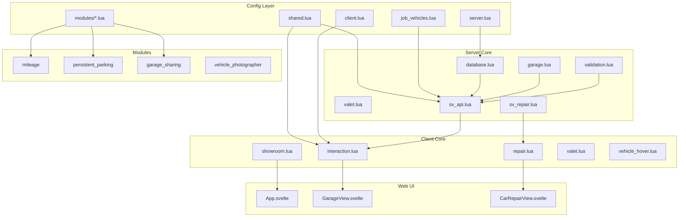

# Codebase Map

This document provides a comprehensive map of the codebase for AI semantic search.

## File Structure

```
dusa_modulargarages/
├── fxmanifest.lua                    # Resource manifest
├── config/
│   ├── shared.lua                    # Shared config (locale, pricing, debug)
│   ├── server.lua                    # Server config (database, security)
│   ├── client.lua                    # Client config (UI, effects)
│   ├── job_vehicles.lua              # Job vehicle definitions
│   └── modules/
│       ├── mileage.lua               # Mileage module config
│       ├── persistent_parking.lua    # Persistent parking config
│       ├── garage_sharing.lua        # Garage sharing config
│       └── vehicle_photographer.lua  # Photo capture config
├── shared/
│   ├── data/
│   │   └── gta_default_models.lua    # Default GTA vehicle models
│   └── utils/
│       ├── debug.lua                 # Debug logging system
│       ├── debug_commands.lua        # Debug commands
│       ├── vehicle_keys.lua          # Vehicle key integration
│       └── VEHICLE_KEYS_README.md    # Key system docs
├── server/
│   ├── proxy_config.lua              # Config proxy for escrow
│   ├── main.lua                      # Server entry point
│   ├── commands.lua                  # Server commands
│   ├── core/
│   │   ├── database.lua              # Database utilities
│   │   ├── database_checker.lua      # Schema validation
│   │   ├── garage.lua                # Core garage logic
│   │   ├── spawn_zones.lua           # Spawn point management
│   │   ├── validation.lua            # Input validation
│   │   ├── valet.lua                 # Valet service logic
│   │   └── modules/
│   │       ├── config_manager.lua    # Config hot-reload
│   │       ├── grade_validator.lua   # Job grade validation
│   │       ├── job_vehicles.lua      # Job vehicle management
│   │       ├── vehicle_ownership.lua # Ownership checks
│   │       └── vehicle_photo_registry.lua # Photo cache
│   ├── api/
│   │   ├── sv_api.lua                # Main server API (callbacks)
│   │   ├── sv_repair.lua             # Repair/fuel API
│   │   └── test_commands.lua         # Test commands
│   ├── database/
│   │   └── migration.lua             # Migration system
│   └── migration/
│       ├── manager.lua               # Migration manager
│       └── adapters/                 # Migration adapters
│           ├── qb-garages.lua
│           ├── qbx_garages.lua
│           ├── cd_garage.lua
│           ├── esx_garage.lua
│           └── ... (13 adapters total)
├── client/
│   ├── main.lua                      # Client entry point
│   ├── commands.lua                  # Client command handlers
│   ├── utils.lua                     # Client utilities
│   ├── ui.lua                        # UI helpers
│   ├── tablet_integration.lua        # Tablet NUI callbacks
│   ├── core/
│   │   ├── bridge_events.lua         # Framework events
│   │   ├── help_menu.lua             # Help system
│   │   ├── interaction.lua           # Garage interaction (main)
│   │   ├── repair.lua                # Repair system
│   │   ├── showroom.lua              # 3D showroom
│   │   ├── showroom_nui.lua          # Showroom NUI
│   │   ├── showroom_retrieval.lua    # Showroom vehicle spawn
│   │   ├── valet.lua                 # Valet client logic
│   │   ├── vehicle_hover.lua         # Hover info system
│   │   └── vehicle_preview.lua       # Vehicle preview
│   └── api/                          # Client API (unused)
├── modules/
│   ├── mileage/
│   │   ├── client.lua                # Mileage tracking client
│   │   ├── server.lua                # Mileage persistence
│   │   └── README.md
│   ├── persistent_parking/
│   │   ├── client.lua                # Persistent spawn client
│   │   └── server.lua                # Fee calculation
│   ├── garage_sharing/
│   │   ├── client.lua                # Sharing UI client
│   │   ├── server.lua                # Access management
│   │   └── README.md
│   └── vehicle_photographer/
│       ├── client.lua                # Photo capture
│       ├── server.lua                # Photo storage
│       ├── map_loader.lua            # Studio map
│       └── default_vehicles.lua      # Default images
├── web/                              # Svelte frontend
│   ├── src/
│   │   ├── App.svelte                # Main app
│   │   ├── main.ts                   # Entry point
│   │   ├── components/
│   │   │   ├── GarageView.svelte     # Main garage view
│   │   │   ├── JobGarageView.svelte  # Job garage view
│   │   │   ├── VehicleCard.svelte    # Vehicle card component
│   │   │   ├── CarRepairView.svelte  # Repair interface
│   │   │   ├── AdminEditorView.svelte # Admin editor
│   │   │   ├── ImpoundMenu.svelte    # Impound management
│   │   │   └── ... (20+ components)
│   │   ├── stores/
│   │   │   └── stores.ts             # Svelte stores
│   │   ├── services/
│   │   │   └── nui.js                # NUI communication
│   │   └── typings/
│   │       ├── events.ts             # Event types
│   │       └── misc.ts               # Misc types
│   └── build/                        # Built files
├── sql/
│   ├── latest/
│   │   └── install.sql               # Fresh install schema
│   ├── release/
│   │   └── consolidated_schema.sql   # Full schema
│   └── migrations/                   # Migration files
├── locales/
│   ├── en.json                       # English
│   ├── tr.json                       # Turkish
│   ├── de.json                       # German
│   ├── es.json                       # Spanish
│   ├── fr.json                       # French
│   ├── it.json                       # Italian
│   └── pl.json                       # Polish
├── presets/                          # Garage presets
│   ├── gabz_mrpd.lua
│   ├── downtown_mechanic.lua
│   └── ... (5 presets)
├── stream/                           # GTA assets
│   └── jim_g_green_screen_v1.*       # Photo studio
└── tests/
    ├── unit/                         # Unit tests
    ├── integration/                  # Integration tests
    └── run_all_tests.lua             # Test runner
```

## Load Order (fxmanifest.lua)

### Shared Scripts (Client + Server)

```lua
1. @ox_lib/init.lua                   -- ox_lib initialization
2. @dusa_bridge/bridge.lua            -- Framework bridge
3. config/*.lua                       -- All config files
4. config/modules/*.lua               -- Module configs
5. shared/utils/debug.lua             -- Debug system
6. shared/utils/debug_commands.lua    -- Debug commands
7. shared/utils/vehicle_keys.lua      -- Key integration
```

### Server Scripts

```lua
1. server/proxy_config.lua            -- Config proxy
2. @oxmysql/lib/MySQL.lua            -- Database driver
3. server/database/migration.lua      -- Migration system
4. server/core/*.lua                  -- Core modules
5. server/core/modules/*.lua          -- Sub-modules
6. server/main.lua                    -- Entry point
7. server/commands.lua                -- Commands
8. server/api/*.lua                   -- API endpoints
9. modules/*/server.lua               -- Module servers
```

### Client Scripts

```lua
1. client/utils.lua                   -- Utilities
2. client/core/*.lua                  -- Core modules
3. client/main.lua                    -- Entry point
4. client/commands.lua                -- Command handlers
5. client/api/*.lua                   -- Client API
6. client/tablet_integration.lua      -- Tablet NUI
7. modules/*/client.lua               -- Module clients
```

## Module Relationships



## Global Modules

### Server-Side Globals

| Global | File | Purpose |
|--------|------|---------|
| `Config` | config/*.lua | All configuration |
| `MileageConfig` | config/modules/mileage.lua | Mileage settings |
| `PersistentParkingConfig` | config/modules/persistent_parking.lua | Parking settings |
| `GarageSharingConfig` | config/modules/garage_sharing.lua | Sharing settings |
| `GarageDatabase` | server/core/database.lua | Database operations |
| `GarageValidation` | server/core/validation.lua | Input validation |
| `VehicleOwnership` | server/core/modules/vehicle_ownership.lua | Ownership checks |

### Client-Side Globals

| Global | File | Purpose |
|--------|------|---------|
| `Config` | config/*.lua | All configuration |
| `GarageDebug` | shared/utils/debug.lua | Debug logging |
| `currentGarage` | client/core/interaction.lua | Active garage |
| `vehiclePreviewing` | client/core/vehicle_preview.lua | Preview state |

## Data Flow

### Store Vehicle Flow

```
1. Player drives into parking zone
2. client/core/interaction.lua detects zone
3. storeVehicle NUI callback triggered
4. lib.callback.await('dusa-garage:server:storeVehicle')
5. server/api/sv_api.lua validates ownership
6. server/core/validation.lua checks permissions
7. MySQL update: vehicle.garage = garageId
8. TriggerClientEvent('dusa-garage:client:vehicleStored')
9. Vehicle entity deleted client-side
```

### Spawn Vehicle Flow

```
1. Player selects vehicle in UI
2. spawnVehicle NUI callback triggered
3. lib.callback.await('dusa-garage:server:spawnVehicle')
4. server/api/sv_api.lua loads vehicle props
5. server/core/spawn_zones.lua finds spawn point
6. CreateVehicleServerSetter (FiveM native)
7. TriggerClientEvent('dusa-garage:client:vehicleSpawned')
8. client/core/interaction.lua sets vehicle props
9. Player placed in vehicle
```

## Key File Locations by Feature

| Feature | Server File | Client File | UI Component |
|---------|-------------|-------------|--------------|
| Store vehicle | sv_api.lua:1063 | interaction.lua:1413 | GarageView.svelte |
| Spawn vehicle | sv_api.lua:1191 | interaction.lua:1528 | VehicleCard.svelte |
| Transfer | sv_api.lua:2820 | main.lua:1236 | TransferConfirmModal.svelte |
| Repair | sv_repair.lua:221 | repair.lua:1041 | CarRepairView.svelte |
| Impound | sv_api.lua:2957 | main.lua:1057 | ImpoundMenu.svelte |
| Job vehicles | sv_api.lua:2354 | main.lua:706 | JobGarageView.svelte |
| Valet | core/valet.lua:476 | core/valet.lua | GarageView.svelte |
| Sharing | sv_api.lua:1460 | interaction.lua:1547 | AdminEditorView.svelte |
