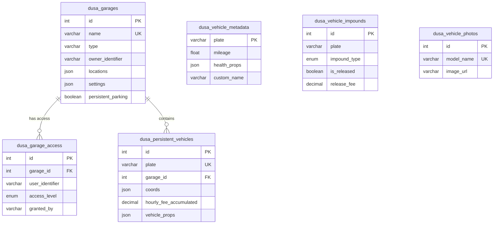

# Database Schema

Complete database schema reference for AI semantic search.

## Tables Overview

| Table | Purpose | Rows (typical) |
|-------|---------|----------------|
| `dusa_garages` | Garage locations and settings | 50-500 |
| `dusa_vehicle_metadata` | Vehicle mileage, health, names | 1000+ |
| `dusa_vehicle_impounds` | Impound records | 100-1000 |
| `dusa_garage_access` | Garage sharing permissions | 100-500 |
| `dusa_vehicle_sharing` | Player vehicle sharing | 50-200 |
| `dusa_persistent_vehicles` | Persistently parked vehicles | 0-500 |
| `dusa_vehicle_photos` | Vehicle image cache | 500+ |
| `dusa_migrations` | Applied migrations | 10-20 |

## Table: dusa_garages

Core garage locations and settings.

```sql
CREATE TABLE `dusa_garages` (
    `id` INT(11) PRIMARY KEY AUTO_INCREMENT,
    `name` VARCHAR(255) NOT NULL UNIQUE,
    `type` VARCHAR(50) NOT NULL DEFAULT 'public',
    `owner_identifier` VARCHAR(255) DEFAULT NULL,
    `locations` LONGTEXT NOT NULL,           -- JSON
    `settings` LONGTEXT DEFAULT NULL,         -- JSON
    `persistent_parking` BOOLEAN DEFAULT NULL,
    `created_at` TIMESTAMP DEFAULT CURRENT_TIMESTAMP,
    `updated_at` TIMESTAMP DEFAULT CURRENT_TIMESTAMP ON UPDATE CURRENT_TIMESTAMP,
    
    KEY `idx_type` (`type`),
    KEY `idx_owner` (`owner_identifier`),
    KEY `idx_persistent_parking` (`persistent_parking`),
    CONSTRAINT `chk_garage_type` CHECK (`type` IN ('public','property','job'))
);
```

### Columns

| Column | Type | Description |
|--------|------|-------------|
| `id` | INT | Primary key |
| `name` | VARCHAR(255) | Unique garage identifier |
| `type` | VARCHAR(50) | "public", "property", or "job" |
| `owner_identifier` | VARCHAR(255) | Owner for property/job garages |
| `locations` | LONGTEXT (JSON) | Coordinates for interaction, spawn, parking |
| `settings` | LONGTEXT (JSON) | Custom garage settings |
| `persistent_parking` | BOOLEAN | Enable persistent vehicle spawning |

### Locations JSON Structure

```json
{
    "interaction": {"x": 0.0, "y": 0.0, "z": 0.0},
    "spawn": [
        {"x": 0.0, "y": 0.0, "z": 0.0, "h": 0.0},
        {"x": 0.0, "y": 0.0, "z": 0.0, "h": 0.0}
    ],
    "parking": {"x": 0.0, "y": 0.0, "z": 0.0, "radius": 5.0},
    "blip": {"sprite": 357, "color": 3, "scale": 0.8}
}
```

### Example Queries

```sql
-- Get all public garages
SELECT * FROM dusa_garages WHERE type = 'public';

-- Get garages owned by player
SELECT * FROM dusa_garages 
WHERE owner_identifier = 'license:abc123' 
   OR type = 'public';

-- Get job garages
SELECT * FROM dusa_garages WHERE type = 'job';

-- Update garage locations
UPDATE dusa_garages 
SET locations = '{"interaction": {...}, "spawn": [...]}' 
WHERE id = 5;
```

---

## Table: dusa_vehicle_metadata

Vehicle mileage, health, and custom names.

```sql
CREATE TABLE `dusa_vehicle_metadata` (
    `plate` VARCHAR(15) PRIMARY KEY,
    `mileage` FLOAT DEFAULT 0,
    `health_props` LONGTEXT DEFAULT NULL,     -- JSON
    `custom_name` VARCHAR(50) DEFAULT NULL,
    `created_at` TIMESTAMP DEFAULT CURRENT_TIMESTAMP,
    `updated_at` TIMESTAMP DEFAULT CURRENT_TIMESTAMP ON UPDATE CURRENT_TIMESTAMP,
    
    KEY `idx_mileage` (`mileage`)
);
```

### Health Props JSON Structure

```json
{
    "engineHealth": 1000.0,
    "bodyHealth": 1000.0,
    "petrolTankHealth": 1000.0,
    "fuelLevel": 100.0,
    "dirtLevel": 0.0,
    "tireBurstState": [false, false, false, false]
}
```

### Example Queries

```sql
-- Get vehicle metadata
SELECT * FROM dusa_vehicle_metadata WHERE plate = 'ABC123';

-- Update mileage
UPDATE dusa_vehicle_metadata 
SET mileage = mileage + 15.5, updated_at = NOW() 
WHERE plate = 'ABC123';

-- Get or create metadata
INSERT INTO dusa_vehicle_metadata (plate, mileage) 
VALUES ('ABC123', 0) 
ON DUPLICATE KEY UPDATE updated_at = NOW();

-- Get high mileage vehicles
SELECT plate, mileage FROM dusa_vehicle_metadata 
WHERE mileage > 10000 ORDER BY mileage DESC;
```

---

## Table: dusa_vehicle_impounds

Impound records and history.

```sql
CREATE TABLE `dusa_vehicle_impounds` (
    `id` INT(11) PRIMARY KEY AUTO_INCREMENT,
    `plate` VARCHAR(15) NOT NULL,
    `impound_type` ENUM('temporary','permanent','paid') DEFAULT 'temporary',
    `reason` TEXT DEFAULT NULL,
    `impounded_by` VARCHAR(255) NOT NULL,
    `impounded_at` TIMESTAMP DEFAULT CURRENT_TIMESTAMP,
    `release_at` TIMESTAMP DEFAULT NULL,
    `duration_hours` INT(11) DEFAULT NULL,
    `is_released` TINYINT(1) DEFAULT 0,
    `released_at` TIMESTAMP DEFAULT NULL,
    `released_by` VARCHAR(255) DEFAULT NULL,
    `release_fee` DECIMAL(10,2) DEFAULT NULL,
    `created_at` TIMESTAMP DEFAULT CURRENT_TIMESTAMP,
    `updated_at` TIMESTAMP DEFAULT CURRENT_TIMESTAMP ON UPDATE CURRENT_TIMESTAMP,
    
    KEY `idx_plate` (`plate`),
    KEY `idx_impounded_by` (`impounded_by`),
    KEY `idx_impound_type` (`impound_type`),
    KEY `idx_is_released` (`is_released`),
    KEY `idx_release_at` (`release_at`)
);
```

### Example Queries

```sql
-- Get active impound for vehicle
SELECT * FROM dusa_vehicle_impounds 
WHERE plate = 'ABC123' AND is_released = 0;

-- Get all active impounds
SELECT * FROM dusa_vehicle_impounds 
WHERE is_released = 0 
ORDER BY impounded_at DESC;

-- Release vehicle
UPDATE dusa_vehicle_impounds 
SET is_released = 1, 
    released_at = NOW(), 
    released_by = 'license:xyz789' 
WHERE id = 5;

-- Get expired temporary impounds
SELECT * FROM dusa_vehicle_impounds 
WHERE impound_type = 'temporary' 
  AND is_released = 0 
  AND release_at < NOW();
```

---

## Table: dusa_garage_access

Garage sharing permissions.

```sql
CREATE TABLE `dusa_garage_access` (
    `id` INT(11) PRIMARY KEY AUTO_INCREMENT,
    `garage_id` INT(11) NOT NULL,
    `user_identifier` VARCHAR(255) NOT NULL,
    `access_level` ENUM('owner', 'user') DEFAULT 'user',
    `granted_by` VARCHAR(255) NOT NULL,
    `granted_at` TIMESTAMP DEFAULT CURRENT_TIMESTAMP,
    `can_manage` TINYINT(1) DEFAULT 0,
    `notes` VARCHAR(255) DEFAULT NULL,
    `created_at` TIMESTAMP DEFAULT CURRENT_TIMESTAMP,
    `updated_at` TIMESTAMP DEFAULT CURRENT_TIMESTAMP ON UPDATE CURRENT_TIMESTAMP,
    
    UNIQUE KEY `uk_garage_user` (`garage_id`, `user_identifier`),
    KEY `idx_garage_id` (`garage_id`),
    KEY `idx_user_identifier` (`user_identifier`),
    KEY `idx_access_level` (`access_level`),
    
    FOREIGN KEY (`garage_id`) REFERENCES `dusa_garages`(`id`) ON DELETE CASCADE
);
```

### Example Queries

```sql
-- Get users with access to garage
SELECT * FROM dusa_garage_access WHERE garage_id = 5;

-- Get garages user has access to
SELECT g.*, ga.access_level 
FROM dusa_garages g
JOIN dusa_garage_access ga ON g.id = ga.garage_id
WHERE ga.user_identifier = 'license:abc123';

-- Grant access
INSERT INTO dusa_garage_access 
(garage_id, user_identifier, access_level, granted_by) 
VALUES (5, 'license:xyz789', 'user', 'license:abc123');

-- Revoke access
DELETE FROM dusa_garage_access 
WHERE garage_id = 5 AND user_identifier = 'license:xyz789';
```

---

## Table: dusa_vehicle_sharing

Player-to-player vehicle sharing (all vehicles).

```sql
CREATE TABLE `dusa_vehicle_sharing` (
    `id` INT(11) PRIMARY KEY AUTO_INCREMENT,
    `owner_identifier` VARCHAR(255) NOT NULL,
    `shared_with_identifier` VARCHAR(255) NOT NULL,
    `granted_by` VARCHAR(255) NOT NULL,
    `granted_at` TIMESTAMP DEFAULT CURRENT_TIMESTAMP,
    `notes` VARCHAR(255) DEFAULT NULL,
    `created_at` TIMESTAMP DEFAULT CURRENT_TIMESTAMP,
    `updated_at` TIMESTAMP DEFAULT CURRENT_TIMESTAMP ON UPDATE CURRENT_TIMESTAMP,
    
    UNIQUE KEY `uk_owner_shared` (`owner_identifier`, `shared_with_identifier`),
    KEY `idx_owner_identifier` (`owner_identifier`),
    KEY `idx_shared_with_identifier` (`shared_with_identifier`)
);
```

---

## Table: dusa_persistent_vehicles

Vehicles parked persistently in garages.

```sql
CREATE TABLE `dusa_persistent_vehicles` (
    `id` INT(11) PRIMARY KEY AUTO_INCREMENT,
    `plate` VARCHAR(15) NOT NULL UNIQUE,
    `garage_id` INT(11) NOT NULL,
    `spawn_index` INT(11) NOT NULL,
    `coords` LONGTEXT NOT NULL,               -- JSON
    `heading` FLOAT NOT NULL,
    `owner_identifier` VARCHAR(255) NOT NULL,
    `hourly_fee_accumulated` DECIMAL(10, 2) DEFAULT 0.00,
    `last_fee_time` TIMESTAMP DEFAULT CURRENT_TIMESTAMP,
    `vehicle_props` LONGTEXT NULL,            -- JSON
    `created_at` TIMESTAMP DEFAULT CURRENT_TIMESTAMP,
    `updated_at` TIMESTAMP DEFAULT CURRENT_TIMESTAMP ON UPDATE CURRENT_TIMESTAMP,
    
    KEY `idx_garage_id` (`garage_id`),
    KEY `idx_owner` (`owner_identifier`),
    
    FOREIGN KEY (`garage_id`) REFERENCES `dusa_garages`(`id`) ON DELETE CASCADE
);
```

### Example Queries

```sql
-- Get vehicles in garage for spawning
SELECT pv.*, vm.mileage, vm.health_props
FROM dusa_persistent_vehicles pv
LEFT JOIN dusa_vehicle_metadata vm ON pv.plate = vm.plate
WHERE pv.garage_id = 5;

-- Add parking fee
UPDATE dusa_persistent_vehicles 
SET hourly_fee_accumulated = LEAST(hourly_fee_accumulated + 50, 10000),
    last_fee_time = NOW()
WHERE last_fee_time < DATE_SUB(NOW(), INTERVAL 1 HOUR);

-- Remove persistent vehicle
DELETE FROM dusa_persistent_vehicles WHERE plate = 'ABC123';
```

---

## Table: dusa_vehicle_photos

Vehicle image cache.

```sql
CREATE TABLE `dusa_vehicle_photos` (
    `id` INT UNSIGNED PRIMARY KEY AUTO_INCREMENT,
    `model_name` VARCHAR(60) NOT NULL UNIQUE,
    `image_url` VARCHAR(512) NOT NULL,
    `checksum` CHAR(64) NULL,
    `width` INT NULL,
    `height` INT NULL,
    `source` VARCHAR(32) DEFAULT 'supabase',
    `uploaded_at` TIMESTAMP DEFAULT CURRENT_TIMESTAMP,
    `updated_at` TIMESTAMP DEFAULT CURRENT_TIMESTAMP ON UPDATE CURRENT_TIMESTAMP,
    
    KEY `idx_uploaded_at` (`uploaded_at`)
);
```

---

## Table: dusa_migrations

Applied database migrations.

```sql
CREATE TABLE `dusa_migrations` (
    `id` INT(11) PRIMARY KEY AUTO_INCREMENT,
    `migration` VARCHAR(255) NOT NULL UNIQUE,
    `batch` INT(11) NOT NULL,
    `applied_at` TIMESTAMP DEFAULT CURRENT_TIMESTAMP
);
```

---

## Entity Relationship Diagram



## Common Query Patterns

### Get Player's Accessible Garages

```sql
SELECT DISTINCT g.*
FROM dusa_garages g
LEFT JOIN dusa_garage_access ga ON g.id = ga.garage_id
WHERE g.type = 'public'
   OR g.owner_identifier = ?
   OR ga.user_identifier = ?;
```

### Get Vehicle with All Metadata

```sql
SELECT 
    pv.*,
    vm.mileage,
    vm.health_props,
    vm.custom_name,
    vi.id as impound_id,
    vi.impound_type,
    vi.reason as impound_reason
FROM player_vehicles pv  -- Framework vehicle table
LEFT JOIN dusa_vehicle_metadata vm ON pv.plate = vm.plate
LEFT JOIN dusa_vehicle_impounds vi ON pv.plate = vi.plate AND vi.is_released = 0
WHERE pv.citizenid = ?;
```
