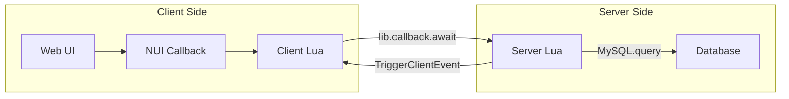

# API Reference

Dusa Modular Garages exposes various APIs for integration with other resources.

## API Types

| Type | Direction | Purpose |
|------|-----------|---------|
| Server Callbacks | Client → Server | Request data or actions |
| Client Events | Server → Client | Push updates to client |
| Server Events | Client → Server | Trigger server actions |
| NUI Callbacks | Web → Client | UI interactions |
| Exports | External → Script | Integration with other resources |

## Communication Flow



## Naming Conventions

| Pattern | Scope | Example |
|---------|-------|---------|
| `dusa-garage:server:*` | Server callbacks | `dusa-garage:server:storeVehicle` |
| `dusa-garage:client:*` | Client events | `dusa-garage:client:vehicleStored` |
| `dusa-garage:editor:*` | Admin editor | `dusa-garage:editor:addUserAccess` |
| `garage:server:*` | Showroom/repair | `garage:server:spawnShowroomVehicle` |
| `garage:client:*` | Client helpers | `garage:client:startVehicleEngine` |

## Quick Reference

### Most Used Callbacks

```lua
-- Store vehicle
lib.callback.await('dusa-garage:server:storeVehicle', false, plate, garageId)

-- Spawn vehicle
lib.callback.await('dusa-garage:server:spawnVehicle', false, plate, garageId)

-- Get garage data
lib.callback.await('dusa-garage:server:getGarageData', false, garageId, ownerIdentifier)

-- Transfer vehicle
lib.callback.await('dusa-garage:server:transferVehicle', false, plate, fromGarageId, toGarageId)
```

### Most Used Events

```lua
-- Vehicle stored notification
RegisterNetEvent('dusa-garage:client:vehicleStored', function(plate) end)

-- Vehicle spawned notification
RegisterNetEvent('dusa-garage:client:vehicleSpawned', function(plate, netId) end)

-- Open garage UI
RegisterNetEvent('dusa-garage:client:openGarage', function(garage, vehicles, config) end)
```

## Response Formats

### Success Response

```lua
{
    success = true,
    data = { ... },       -- Optional data payload
    message = "Success"   -- Optional message
}
```

### Error Response

```lua
{
    success = false,
    error = "ERROR_CODE",
    message = "Human readable error message"
}
```

### Common Error Codes

| Code | Description |
|------|-------------|
| `NOT_OWNER` | Player doesn't own the vehicle |
| `VEHICLE_SPAWNED` | Vehicle is currently spawned |
| `INVALID_GARAGE` | Garage doesn't exist |
| `NO_PERMISSION` | Player lacks permission |
| `VEHICLE_IMPOUNDED` | Vehicle is impounded |
| `INSUFFICIENT_FUNDS` | Not enough money |
| `RATE_LIMITED` | Too many requests |

## Integration Examples

### Tablet App Integration

```lua
-- Register NUI callback for tablet
RegisterNUICallback('garage:getAllPublicGarages', function(_, cb)
    local garages = lib.callback.await('dusa-garage:server:getAllPublicGarages', false)
    cb(garages)
end)
```

### External Resource Integration

```lua
-- Check if vehicle is in garage (from another resource)
local isInGarage = exports['dusa_modulargarages']:IsVehicleInGarage(plate)

-- Get vehicle's current garage
local garageId = exports['dusa_modulargarages']:GetVehicleGarage(plate)
```

## Sections

<CardGroup cols={2}>
  <Card title="Server Callbacks" icon="server" href="/api-reference/callbacks">
    All lib.callback registered endpoints
  </Card>
  <Card title="Events" icon="bolt" href="/api-reference/events">
    Server and client events
  </Card>
  <Card title="NUI Callbacks" icon="window" href="/api-reference/nui-callbacks">
    Web UI to Lua communication
  </Card>
  <Card title="Exports" icon="plug" href="/api-reference/exports">
    External resource integration
  </Card>
</CardGroup>
