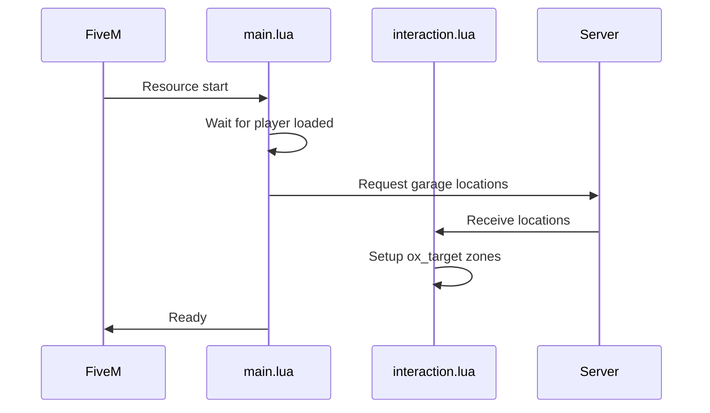

# Client Overview

The client-side handles UI display, vehicle spawning, zone interaction, and NUI communication.

## Module Architecture

```
client/
├── main.lua                  # Entry point and event handlers
├── commands.lua              # Client command handlers
├── utils.lua                 # Utility functions
├── ui.lua                    # UI helpers
├── tablet_integration.lua    # Tablet NUI callbacks
└── core/
    ├── bridge_events.lua     # Framework event handlers
    ├── help_menu.lua         # Help system
    ├── interaction.lua       # Main garage interaction (1800+ lines)
    ├── repair.lua            # Repair showroom client
    ├── showroom.lua          # 3D vehicle showroom
    ├── showroom_nui.lua      # Showroom NUI callbacks
    ├── showroom_retrieval.lua # Showroom vehicle spawn
    ├── valet.lua             # Valet NPC logic
    ├── vehicle_hover.lua     # Hover info display
    └── vehicle_preview.lua   # Vehicle preview system
```

## Initialization Flow



## Core Modules

### interaction.lua

The main interaction module (1800+ lines) handles:

- Zone creation and management (ox_target)
- Garage UI opening/closing
- NUI callback registration
- Vehicle preview
- Access management UI

```lua
-- Key globals
currentGarage = nil           -- Active garage data
currentVehicles = {}          -- Vehicles in current garage
isGarageOpen = false          -- UI state

-- Key functions
OpenGarage(garage, vehicles, config)
CloseGarage()
RefreshGarageZones()
SetupGarageZone(garage)
```

### repair.lua

3D repair showroom logic:

```lua
-- Key functions
OpenRepairView(plate, vehicleData)
CloseRepairView()
SpawnRepairVehicle(plate, props)
UpdateRepairCallouts(vehicle)
CalculateRepairCosts(healthProps)
```

### showroom.lua

3D vehicle gallery:

```lua
-- Key functions
EnterShowroom()
ExitShowroom()
SpawnShowroomVehicle(model, props)
UpdateCameraPosition(rotation, zoom)
```

### valet.lua

NPC valet delivery system:

```lua
-- Key functions
StartValetDelivery(vehicleNetId, npcModel, config)
UpdateValetNPC()
CompleteDelivery()
FallbackToDirectSpawn()
```

## NUI Communication

### Sending to UI

```lua
-- Open UI
SendNUIMessage({
    type = 'openGarage',
    garage = garageData,
    vehicles = vehicleList,
    config = uiConfig
})

-- Update data
SendNUIMessage({
    type = 'updateVehicles',
    vehicles = newVehicleList
})

-- Show notification
SendNUIMessage({
    type = 'notify',
    message = 'Vehicle stored!',
    notifyType = 'success'
})
```

### Receiving from UI (NUI Callbacks)

```lua
RegisterNUICallback('spawnVehicle', function(data, cb)
    -- data.plate, data.garageId from UI
    
    -- Call server
    local result = lib.callback.await('dusa-garage:server:spawnVehicle', false, data.plate, data.garageId)
    
    -- Return to UI
    cb(result)
end)
```

### Focus Management

```lua
-- Enable UI focus
SetNuiFocus(true, true)  -- keyboard, mouse

-- Disable UI focus
SetNuiFocus(false, false)

-- Disable controls while UI open
CreateThread(function()
    while isGarageOpen do
        for _, control in ipairs(Config.Client.Controls.DisableControlsInUI) do
            DisableControlAction(0, control, true)
        end
        Wait(0)
    end
end)
```

## Zone Management

Using ox_target for interaction:

```lua
-- Create garage zone
exports.ox_target:addBoxZone({
    coords = garage.locations.interaction,
    size = vec3(4, 4, 3),
    rotation = 0,
    debug = Config.Debug.Enabled,
    options = {
        {
            name = 'garage_' .. garage.id,
            label = 'Open ' .. garage.name,
            icon = 'fas fa-warehouse',
            onSelect = function()
                OpenGarage(garage)
            end,
            canInteract = function()
                return CanAccessGarage(garage)
            end
        }
    }
})

-- Remove zone
exports.ox_target:removeZone('garage_' .. garage.id)
```

## Vehicle Operations

### Spawning

```lua
-- Request spawn from server
local result = lib.callback.await('dusa-garage:server:spawnVehicle', false, plate, garageId)

if result.success then
    -- Get vehicle from network ID
    local vehicle = NetToVeh(result.netId)
    
    -- Apply properties
    lib.setVehicleProperties(vehicle, result.props)
    
    -- Set player in vehicle
    TaskWarpPedIntoVehicle(PlayerPedId(), vehicle, -1)
    
    -- Start engine
    SetVehicleEngineOn(vehicle, true, true, false)
end
```

### Storing

```lua
-- Get current vehicle
local vehicle = GetVehiclePedIsIn(PlayerPedId(), false)
local plate = GetVehicleNumberPlateText(vehicle)

-- Request store
local result = lib.callback.await('dusa-garage:server:storeVehicle', false, plate, garageId)

if result.success then
    -- Delete local entity
    DeleteVehicle(vehicle)
    
    -- Update UI
    SendNUIMessage({ type = 'vehicleStored', plate = plate })
end
```

## Event Handlers

### Framework Events

```lua
-- QBCore
RegisterNetEvent('QBCore:Client:OnPlayerLoaded', function()
    TriggerServerEvent('dusa-garage:server:requestGarageLocations')
end)

-- ESX
RegisterNetEvent('esx:playerLoaded', function()
    TriggerServerEvent('dusa-garage:server:requestGarageLocations')
end)

-- QBox
RegisterNetEvent('qbx:playerLoaded', function()
    TriggerServerEvent('dusa-garage:server:requestGarageLocations')
end)
```

### Garage Events

```lua
RegisterNetEvent('dusa-garage:client:openGarage', function(garage, vehicles, config)
    currentGarage = garage
    currentVehicles = vehicles
    
    SendNUIMessage({
        type = 'openGarage',
        garage = garage,
        vehicles = vehicles,
        config = config
    })
    
    SetNuiFocus(true, true)
    isGarageOpen = true
end)
```

## State Management

```lua
-- Current state variables
local currentGarage = nil
local currentVehicles = {}
local isGarageOpen = false
local isPreviewActive = false
local previewVehicle = nil
local activeValetDelivery = nil

-- State reset on close
local function ResetState()
    currentGarage = nil
    currentVehicles = {}
    isGarageOpen = false
    
    if previewVehicle then
        DeleteVehicle(previewVehicle)
        previewVehicle = nil
    end
    
    SetNuiFocus(false, false)
end
```

## Performance Considerations

### Throttling

```lua
-- Throttle frequent operations
local lastUpdate = 0
CreateThread(function()
    while true do
        local now = GetGameTimer()
        if now - lastUpdate > Config.Client.Performance.UpdateInterval then
            -- Perform update
            lastUpdate = now
        end
        Wait(100)
    end
end)
```

### Distance Checks

```lua
-- Only process nearby garages
local playerCoords = GetEntityCoords(PlayerPedId())
for _, garage in pairs(garages) do
    local distance = #(playerCoords - garage.coords)
    if distance < Config.Client.Performance.RenderDistance then
        -- Process garage
    end
end
```
