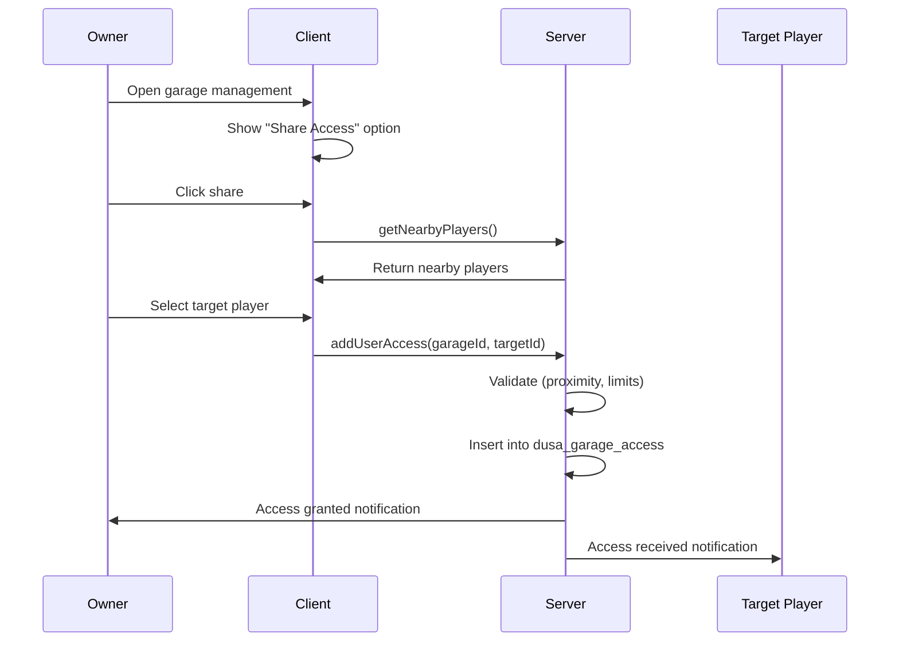

# Garage Sharing Module

Allow players to share garage access with friends and organization members.

## Features

- Share garage access with other players
- Configurable access limits
- Proximity-based sharing
- Duplicate spawn prevention
- Cascading share options

## Configuration

Located in `config/modules/garage_sharing.lua`:

```lua
GarageSharingConfig = {
    enabled = true,
    
    -- Access limits
    maxSharedUsers = 3,           -- Max users per garage (excluding owner)
    
    -- Proximity
    requireProximity = true,      -- Must be nearby to share
    proximityDistance = 10.0,     -- Distance in meters
    
    -- Garage type permissions
    allowPropertyGarages = true,
    allowPublicGarages = true,
    allowJobGarages = false,
    
    -- Spawn control
    preventDuplicateSpawn = true,
    showDisabledVehicles = true,
    spawnCheckInterval = 5000,
    
    ui = {
        showAccessLevel = true,
        showGrantedBy = false,
        showGrantedAt = false,
        showGarageSelector = true,
        switchAnimationDuration = 300,
    },
    
    notifications = {
        onAccessGranted = true,
        onAccessRevoked = true,
        notifyOwnerOnAdd = true,
        notifyOwnerOnRemove = true,
        duration = 5000,
    },
    
    permissions = {
        allowUserManagement = false,
        allowCascadeSharing = false,
        confirmBeforeRemove = true,
        allowPersistentParking = true,
        allowRepair = true,
        allowTransfer = true,
        allowImpoundRelease = true,
    },
    
    rateLimit = {
        enabled = true,
        maxOperations = 5,
        timeWindow = 60000,
        cooldownTime = 30000,
    },
    
    security = {
        logAccessChanges = true,
        validateIdentifiers = true,
        preventSelfAdd = true,
        requireOnlineForAdd = false,
    }
}
```

## Database Schema

```sql
-- Garage-level sharing
CREATE TABLE `dusa_garage_access` (
    `id` INT PRIMARY KEY AUTO_INCREMENT,
    `garage_id` INT NOT NULL,
    `user_identifier` VARCHAR(255) NOT NULL,
    `access_level` ENUM('owner', 'user') DEFAULT 'user',
    `granted_by` VARCHAR(255) NOT NULL,
    `granted_at` TIMESTAMP DEFAULT CURRENT_TIMESTAMP,
    `can_manage` TINYINT(1) DEFAULT 0,
    `notes` VARCHAR(255),
    
    UNIQUE KEY (`garage_id`, `user_identifier`),
    FOREIGN KEY (`garage_id`) REFERENCES `dusa_garages`(`id`) ON DELETE CASCADE
);

-- Player-level sharing (all vehicles)
CREATE TABLE `dusa_vehicle_sharing` (
    `id` INT PRIMARY KEY AUTO_INCREMENT,
    `owner_identifier` VARCHAR(255) NOT NULL,
    `shared_with_identifier` VARCHAR(255) NOT NULL,
    `granted_by` VARCHAR(255) NOT NULL,
    `granted_at` TIMESTAMP DEFAULT CURRENT_TIMESTAMP,
    
    UNIQUE KEY (`owner_identifier`, `shared_with_identifier`)
);
```

## Access Levels

| Level | Description | Permissions |
|-------|-------------|-------------|
| `owner` | Original garage owner | Full control |
| `user` | Shared access user | Configurable via `permissions` |

## Sharing Flow



## Permission Options

### User Permissions

```lua
permissions = {
    allowUserManagement = false,  -- Can users add/remove others?
    allowCascadeSharing = false,  -- Can shared users share further?
    confirmBeforeRemove = true,   -- Require confirmation to remove
    allowPersistentParking = true,
    allowRepair = true,
    allowTransfer = true,
    allowImpoundRelease = true,
}
```

### Per-Feature Access

| Permission | Description |
|------------|-------------|
| `allowPersistentParking` | Use persistent parking spots |
| `allowRepair` | Use repair/refuel services |
| `allowTransfer` | Transfer vehicles between garages |
| `allowImpoundRelease` | Release impounded vehicles |

## Rate Limiting

Prevent abuse with rate limiting:

```lua
rateLimit = {
    enabled = true,
    maxOperations = 5,     -- Max add/remove operations
    timeWindow = 60000,    -- Per minute
    cooldownTime = 30000,  -- Cooldown after hitting limit
}
```

## API

### Server Callbacks

```lua
-- Add user access
lib.callback.register('dusa-garage:editor:addUserAccess', function(source, garageId, playerIdentifier)
    -- Returns: {success, message}
end)

-- Remove user access
lib.callback.register('dusa-garage:editor:removeUserAccess', function(source, garageId, playerIdentifier)
    -- Returns: {success, message}
end)

-- Get user access list
lib.callback.register('dusa-garage:editor:getUserAccess', function(source, garageId)
    -- Returns: {users = [...]}
end)
```

### NUI Callbacks

```lua
-- From web UI
RegisterNUICallback('getUserAccess', function(data, cb))
RegisterNUICallback('addUserAccess', function(data, cb))
RegisterNUICallback('removeUserAccess', function(data, cb))
RegisterNUICallback('getNearbyPlayers', function(data, cb))
```

## Helper Functions

```lua
-- Check if garage type allows sharing
GarageSharingConfig.IsGarageTypeAllowed(garageType)
-- Returns: boolean

-- Check if user can manage access
GarageSharingConfig.CanManageAccess(accessLevel)
-- Returns: boolean

-- Get display name for access level
GarageSharingConfig.GetAccessLevelName(accessLevel)
-- Returns: "Owner" or "User"
```

## Troubleshooting

<AccordionGroup>
  <Accordion title="Cannot share with player">
    1. Check `GarageSharingConfig.enabled = true`
    2. Verify garage type is allowed for sharing
    3. Check `maxSharedUsers` limit
    4. If `requireProximity = true`, ensure target is within range
    5. Check rate limiting hasn't been triggered
  </Accordion>
  
  <Accordion title="Shared user cannot see vehicles">
    1. Verify access was granted successfully
    2. Check `dusa_garage_access` table for entry
    3. Ensure garage type matches (property, public, job)
    4. Check if vehicle is currently spawned by owner
  </Accordion>
  
  <Accordion title="Duplicate vehicle spawn">
    1. Enable `preventDuplicateSpawn = true`
    2. Check `spawnCheckInterval` is reasonable
    3. Verify vehicle spawn tracking is working
  </Accordion>
</AccordionGroup>
