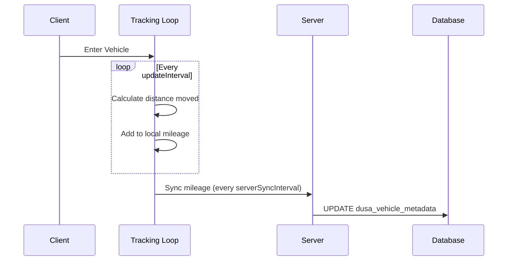

# Mileage Module

The mileage module tracks total distance traveled by vehicles and displays a real-time odometer.

## Features

- Real-time distance tracking
- Odometer UI display
- Database persistence
- Configurable units (km/miles)
- Vehicle class exclusions

## Configuration

Located in `config/modules/mileage.lua`:

```lua
MileageConfig = {
    enabled = true,
    
    tracking = {
        updateInterval = 1000,        -- Position check interval (ms)
        serverSyncInterval = 300000,  -- Database sync (5 minutes)
        minSpeed = 5.0,               -- Minimum speed to track (km/h)
        excludedVehicleClasses = {
            13, -- Cycles
            14, -- Boats
            15, -- Helicopters
            16, -- Planes
            17, -- Service
            21  -- Trains
        }
    },
    
    ui = {
        enabled = true,
        displayMode = "first_person", -- "show_on_enter" | "always" | "first_person"
        showDuration = 10000,         -- Duration for show_on_enter (ms)
        unit = "kilometers",          -- "kilometers" | "miles"
        position = "bottom-right"
    }
}
```

## Display Modes

| Mode | Behavior |
|------|----------|
| `first_person` | Show only in first-person view |
| `show_on_enter` | Show briefly when entering vehicle |
| `always` | Always visible while in vehicle |

## Database Schema

```sql
-- Mileage stored in dusa_vehicle_metadata
CREATE TABLE `dusa_vehicle_metadata` (
    `plate` VARCHAR(15) PRIMARY KEY,
    `mileage` FLOAT DEFAULT 0,  -- Total km traveled
    -- other fields...
);
```

## How It Works



## API

### Client Exports

```lua
-- Get current vehicle mileage
local mileage = exports['dusa_modulargarages']:GetVehicleMileage(plate)

-- Convert units
local miles = mileage * MileageConfig.CONVERSION.KM_TO_MILES
```

### Events

```lua
-- Client event when mileage updates
RegisterNetEvent('dusa-garage:mileage:updated', function(plate, newMileage)
    print(('Vehicle %s: %d km'):format(plate, newMileage))
end)
```

## Unit Conversion

```lua
MileageConfig.CONVERSION = {
    KM_TO_MILES = 0.621371,
    MILES_TO_KM = 1.60934
}

-- Usage
local km = 100
local miles = km * MileageConfig.CONVERSION.KM_TO_MILES
-- Result: 62.14 miles
```

## Vehicle Class Exclusions

Excluded classes don't track mileage:

| Class ID | Vehicle Type |
|----------|--------------|
| 13 | Cycles |
| 14 | Boats |
| 15 | Helicopters |
| 16 | Planes |
| 17 | Service |
| 21 | Trains |

## Integration with Repair

The mileage module integrates with the repair showroom:

- Odometer displayed in 3D repair view
- Estimated range calculated based on fuel and mileage
- Range formula: `(fuelLevel / 100) * defaultVehicleRange`

## Troubleshooting

<AccordionGroup>
  <Accordion title="Mileage not tracking">
    1. Check `MileageConfig.enabled = true`
    2. Verify vehicle class not in excluded list
    3. Check speed exceeds `minSpeed`
    4. Enable debug: `Config.Debug.Topics["mileage-tracking"].enabled = true`
  </Accordion>
  
  <Accordion title="Odometer not showing">
    1. Check `MileageConfig.ui.enabled = true`
    2. Verify display mode settings
    3. Check if in first-person (for `first_person` mode)
  </Accordion>
  
  <Accordion title="Mileage not saving">
    1. Check database connection
    2. Verify `dusa_vehicle_metadata` table exists
    3. Check server sync interval hasn't been set too high
  </Accordion>
</AccordionGroup>
