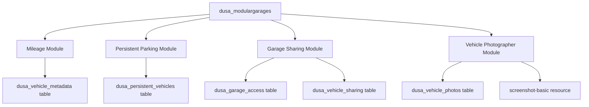

# Modules Overview

Dusa Modular Garages includes optional modules that can be enabled/disabled independently.

## Available Modules

| Module | Config File | Purpose |
|--------|-------------|---------|
| Mileage | `config/modules/mileage.lua` | Track vehicle distance traveled |
| Persistent Parking | `config/modules/persistent_parking.lua` | Vehicles remain in world |
| Garage Sharing | `config/modules/garage_sharing.lua` | Share garage access |
| Vehicle Photographer | `config/modules/vehicle_photographer.lua` | Capture vehicle images |

## Module Architecture

```
modules/
├── mileage/
│   ├── client.lua          # Client-side tracking
│   ├── server.lua          # Database sync
│   └── README.md
├── persistent_parking/
│   ├── client.lua          # Vehicle spawning/despawning
│   └── server.lua          # Fee calculation
├── garage_sharing/
│   ├── client.lua          # UI integration
│   ├── server.lua          # Access management
│   └── README.md
└── vehicle_photographer/
    ├── client.lua          # Photo capture
    ├── server.lua          # Image storage
    ├── map_loader.lua      # Map for photo studio
    └── default_vehicles.lua
```

## Enabling/Disabling Modules

Each module has a master toggle in its config:

```lua
-- Mileage Module
MileageConfig.enabled = true

-- Persistent Parking Module
PersistentParkingConfig.enabled = true

-- Garage Sharing Module
GarageSharingConfig.enabled = true
```

## Module Dependencies



## Feature Interactions

### Mileage + Repair
- Mileage affects estimated vehicle range
- Repair showroom displays odometer

### Persistent Parking + Garage Sharing
- Shared users can see persistent vehicles
- Access permissions apply to persistent parking

### Vehicle Photographer + UI
- Photos displayed in vehicle cards
- Captured automatically when no image exists

## Quick Start

<Tabs>
  <Tab title="Enable All">
    ```lua
    -- Enable all modules
    MileageConfig.enabled = true
    PersistentParkingConfig.enabled = true
    GarageSharingConfig.enabled = true
    ```
  </Tab>
  <Tab title="Minimal">
    ```lua
    -- Disable optional modules for minimal setup
    MileageConfig.enabled = false
    PersistentParkingConfig.enabled = false
    GarageSharingConfig.enabled = false
    ```
  </Tab>
</Tabs>
