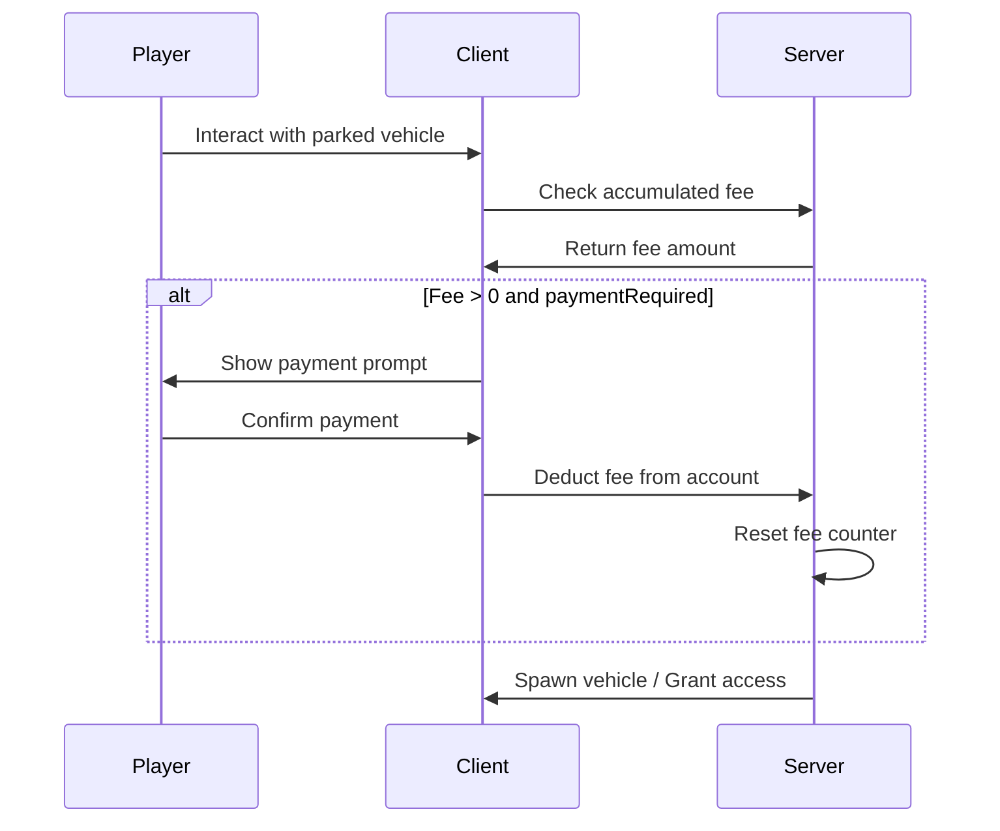

# Persistent Parking Module

Vehicles parked in enabled garages persist in the game world and accumulate hourly parking fees.

## Features

- Vehicles spawn on server start
- Hourly parking fee accumulation
- Smooth fade in/out animations
- Hover interaction system
- Performance optimizations

## Configuration

Located in `config/modules/persistent_parking.lua`:

```lua
PersistentParkingConfig = {
    enabled = true,
    
    rendering = {
        distance = 100.0,           -- Render distance (meters)
        updateInterval = 1000,      -- Check interval (ms)
        cleanupDistance = 120.0,    -- Despawn distance
        maxVehiclesPerGarage = 50,
        
        cullDistance = 100.0,       -- Hide vehicles beyond this
        cullCheckInterval = 2000,
        
        fadeIn = {
            enabled = true,
            duration = 1000,
            startAlpha = 0,
            endAlpha = 255
        },
        fadeOut = {
            enabled = true,
            duration = 800,
            startAlpha = 255,
            endAlpha = 0
        }
    },
    
    fees = {
        enabled = true,
        hourlyRate = 50,
        cronExpression = "0 * * * *", -- Every hour
        maxAccumulatedFee = 10000,
        paymentRequired = true
    },
    
    interaction = {
        key = 'F',
        hoverDistance = 10.0,
        showOwnerOnly = true,
        allowDirectEntry = true
    },
    
    ui = {
        showVehicleInfo = true,
        showAccumulatedFee = true,
        updateInterval = 100,
        fadeDistance = 5.0
    },
    
    performance = {
        entityPooling = true,
        streamingBudget = 1000000,
        maxConcurrentSpawns = 5
    }
}
```

## Database Schema

```sql
CREATE TABLE `dusa_persistent_vehicles` (
    `id` INT PRIMARY KEY AUTO_INCREMENT,
    `plate` VARCHAR(15) NOT NULL UNIQUE,
    `garage_id` INT NOT NULL,
    `spawn_index` INT NOT NULL,
    `coords` LONGTEXT NOT NULL,
    `heading` FLOAT NOT NULL,
    `owner_identifier` VARCHAR(255) NOT NULL,
    `hourly_fee_accumulated` DECIMAL(10, 2) DEFAULT 0.00,
    `last_fee_time` TIMESTAMP DEFAULT CURRENT_TIMESTAMP,
    `vehicle_props` LONGTEXT NULL,
    
    FOREIGN KEY (`garage_id`) REFERENCES `dusa_garages`(`id`) ON DELETE CASCADE
);
```

## Enabling Per-Garage

Persistent parking can be enabled per garage:

```lua
-- In garage locations JSON
{
    "name": "Downtown Parking",
    "type": "public",
    "persistent_parking": true,  -- Enable for this garage
    "locations": {...}
}
```

Or via database:

```sql
UPDATE dusa_garages 
SET persistent_parking = 1 
WHERE name = 'Downtown Parking';
```

## Fee System

### Fee Calculation

```lua
-- Cron runs every hour
fee_accumulated = fee_accumulated + hourlyRate

-- Capped at maximum
if fee_accumulated > maxAccumulatedFee then
    fee_accumulated = maxAccumulatedFee
end
```

### Payment Flow



## Interaction System

### Hover Info

When approaching a persistent vehicle:

```
┌─────────────────────────┐
│  ★ Nissan Skyline       │
│  Plate: ABC123          │
│  ────────────────────── │
│  Parking Fee: $150      │
│  Press [F] to retrieve  │
└─────────────────────────┘
```

### Interaction Options

| Action | Description |
|--------|-------------|
| Press F | Enter/retrieve vehicle |
| View Info | See vehicle details and fees |

## Performance Optimizations

### Entity Pooling

Reuses vehicle entities instead of creating/destroying:

```lua
performance = {
    entityPooling = true,      -- Enable pooling
    streamingBudget = 1000000, -- Memory budget
    maxConcurrentSpawns = 5    -- Parallel spawn limit
}
```

### Distance Culling

Vehicles beyond `cullDistance` are temporarily hidden:

```lua
-- When player moves away
if distance > cullDistance then
    SetEntityAlpha(vehicle, 0, false)
end

-- When player returns
if distance < cullDistance then
    SetEntityAlpha(vehicle, 255, false)
end
```

## Events

### Server Events

```lua
-- Vehicle parked persistently
RegisterNetEvent('dusa-garage:persistent:vehicleParked', function(plate, garageId)
    -- Handle parking
end)

-- Vehicle retrieved
RegisterNetEvent('dusa-garage:persistent:vehicleRetrieved', function(plate, playerId)
    -- Handle retrieval
end)
```

### Client Events

```lua
-- Hover state change
RegisterNetEvent('dusa-garage:persistent:hoverEnter', function(vehicleData)
    -- Show hover UI
end)

RegisterNetEvent('dusa-garage:persistent:hoverExit', function()
    -- Hide hover UI
end)
```

## Troubleshooting

<AccordionGroup>
  <Accordion title="Vehicles not spawning on server start">
    1. Check `PersistentParkingConfig.enabled = true`
    2. Verify `dusa_persistent_vehicles` table has data
    3. Check garage has `persistent_parking = true`
    4. Enable debug: `Config.Debug.Topics["persistent-parking"].enabled = true`
  </Accordion>
  
  <Accordion title="High server resource usage">
    1. Reduce `rendering.distance`
    2. Enable `performance.entityPooling`
    3. Lower `maxVehiclesPerGarage`
    4. Increase `rendering.updateInterval`
  </Accordion>
  
  <Accordion title="Fees not accumulating">
    1. Check `fees.enabled = true`
    2. Verify cron expression syntax
    3. Check database `last_fee_time` is updating
  </Accordion>
</AccordionGroup>
