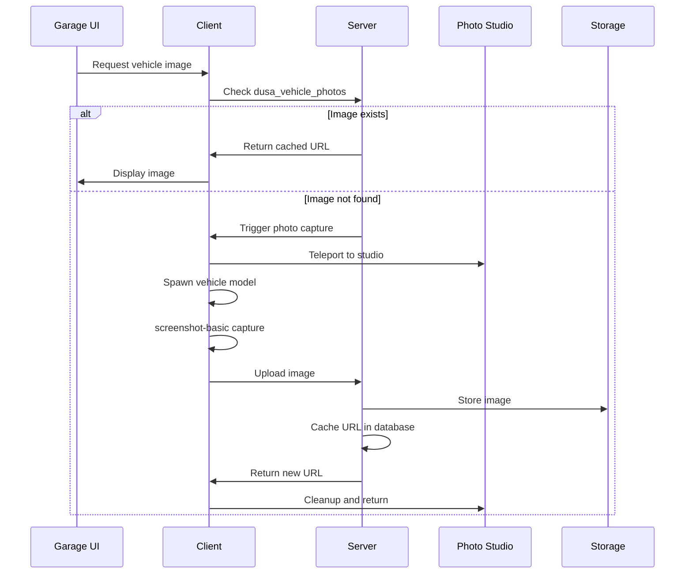

# Vehicle Photographer Module

Automatically captures vehicle images for display in the garage UI.

## Features

- Automatic photo capture
- Green screen studio environment
- Image caching to database
- External storage support
- Default vehicle images

## Dependencies

- `screenshot-basic` resource (required)
- Optional: External image storage (Supabase, S3, etc.)

## Files

```
modules/vehicle_photographer/
├── client.lua           # Photo capture logic
├── server.lua           # Image storage and retrieval
├── map_loader.lua       # Green screen studio map
└── default_vehicles.lua # Fallback vehicle images
```

## Database Schema

```sql
CREATE TABLE `dusa_vehicle_photos` (
    `id` INT UNSIGNED PRIMARY KEY AUTO_INCREMENT,
    `model_name` VARCHAR(60) NOT NULL UNIQUE,
    `image_url` VARCHAR(512) NOT NULL,
    `checksum` CHAR(64) NULL,
    `width` INT NULL,
    `height` INT NULL,
    `source` VARCHAR(32) DEFAULT 'supabase',
    `uploaded_at` TIMESTAMP DEFAULT CURRENT_TIMESTAMP
);
```

## Photo Capture Flow



## Photo Studio

The green screen studio is loaded from:
- `stream/jim_g_green_screen_v1.ydr`
- `stream/jim_g_green_screen_v1.ymap`
- `stream/jim_g_green_screen_v1.ytyp`

### Studio Location

Default coordinates (configurable):
```lua
-- In Config.RepairShowroom.spawnCoords
vector4(228.534, -990.986, -99.424, 179.967)
```

## Default Images

The `default_vehicles.lua` file contains fallback URLs for common vehicles:

```lua
DefaultVehicleImages = {
    ["adder"] = "https://storage.example.com/vehicles/adder.png",
    ["zentorno"] = "https://storage.example.com/vehicles/zentorno.png",
    -- ... more vehicles
}
```

These are used when:
- Photo capture fails
- External storage is unavailable
- Quick loading is needed

## API

### Server Callbacks

```lua
-- Get vehicle image URL
lib.callback.register('garage:getVehicleImage', function(source, modelName)
    -- Returns: image URL string or nil
end)

-- Register new vehicle photo
lib.callback.register('garage:registerVehiclePhoto', function(source, modelName, imageUrl)
    -- Returns: {success, message}
end)
```

### Exports

```lua
-- Server export: Get vehicle image
local imageUrl = exports['dusa_modulargarages']:GetVehicleImage(modelName)

-- Server export: Register vehicle photo
exports['dusa_modulargarages']:RegisterVehiclePhoto(modelName, imageUrl, checksum)
```

## Storage Options

### Supabase (Default)

```lua
-- Server-side storage configuration
VehiclePhotoConfig = {
    storage = "supabase",
    bucket = "vehicle-images",
    supabaseUrl = "https://xxx.supabase.co",
    supabaseKey = "your-service-key"
}
```

### Local Files

Images can be stored in `vehicle_images/` directory:

```lua
VehiclePhotoConfig = {
    storage = "local",
    path = "vehicle_images/"
}
```

### Custom Storage

Implement custom storage via exports:

```lua
exports['dusa_modulargarages']:SetPhotoStorageHandler(function(imageData, modelName)
    -- Upload to custom storage
    -- Return URL string
end)
```

## Performance

### Caching

- Images cached in database after first capture
- Reduces repeated photo sessions
- Checksums prevent duplicate uploads

### Batch Processing

For servers with many custom vehicles:

```lua
-- Server command to pre-generate all vehicle images
/garage generateAllPhotos
```

## Troubleshooting

<AccordionGroup>
  <Accordion title="Photos not capturing">
    1. Verify `screenshot-basic` is installed and running
    2. Check studio map is loaded correctly
    3. Verify vehicle model exists and can spawn
    4. Check for Lua errors in console
  </Accordion>
  
  <Accordion title="Photos not displaying in UI">
    1. Check `dusa_vehicle_photos` table has entries
    2. Verify image URLs are accessible
    3. Check browser console for CORS errors
    4. Try using `default_vehicles.lua` images
  </Accordion>
  
  <Accordion title="Storage upload failures">
    1. Verify storage credentials
    2. Check bucket permissions
    3. Verify image size limits
    4. Check server has internet access
  </Accordion>
</AccordionGroup>
