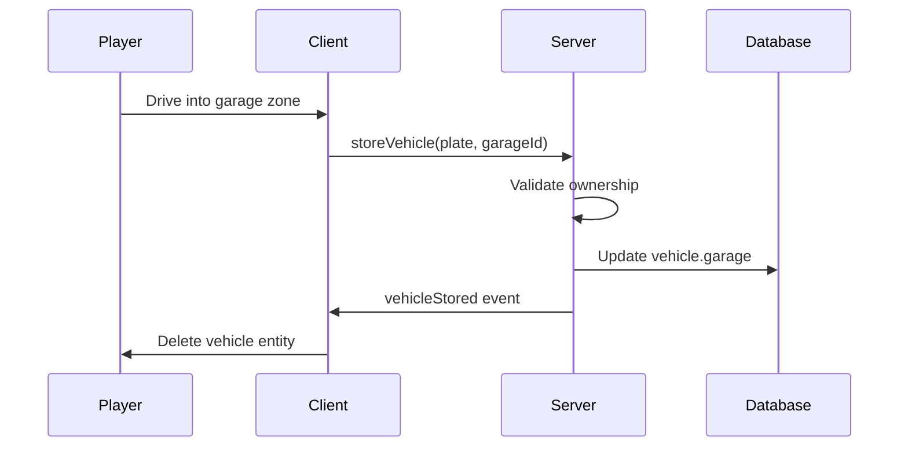
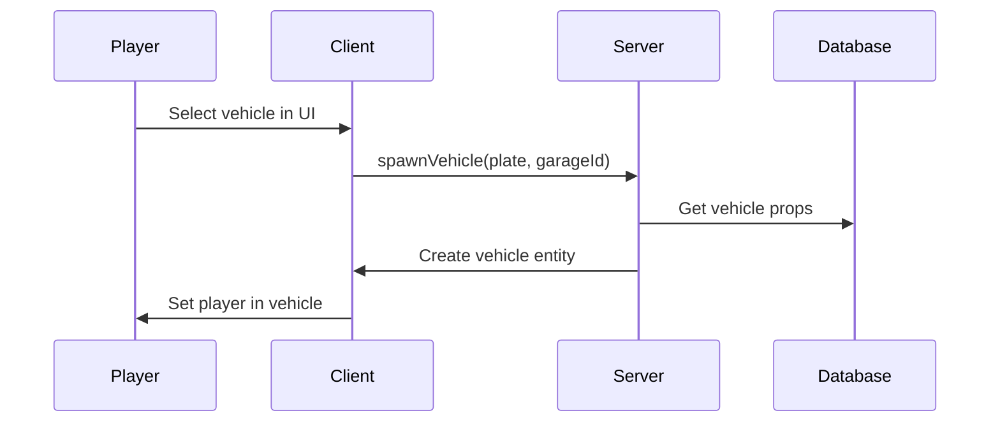
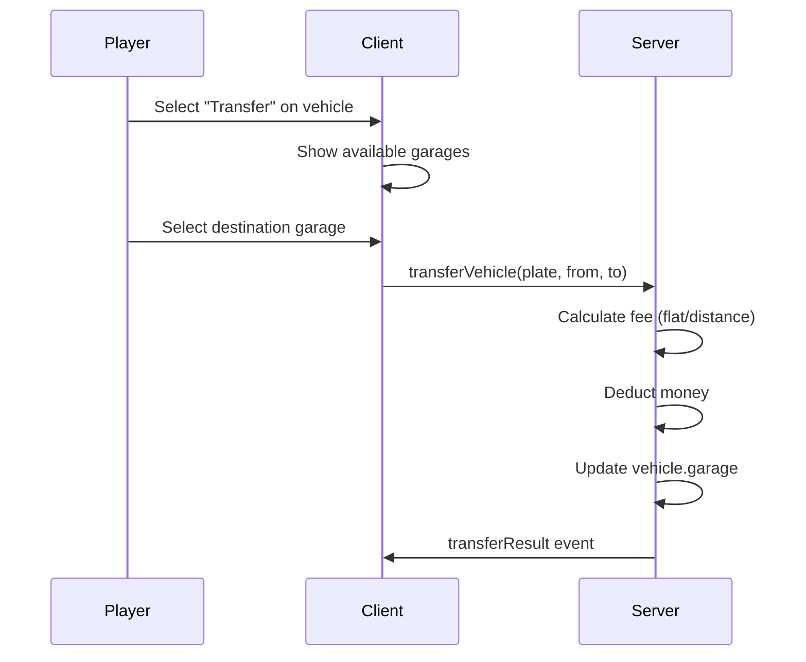

# Quick Start Guide

This guide will help you get a basic garage system running quickly.

## Minimal Setup

<Steps>
  <Step title="Enable Database Auto-Migration">
    In `config/server.lua`:
    ```lua
    Config.Server.Database = {
        AutoMigrate = true,
        AutoCheckDatabase = true,
    }
    ```
  </Step>
  
  <Step title="Set Your Locale">
    In `config/shared.lua`:
    ```lua
    Config.Locale = "en"  -- Options: en, tr, de, es, fr, it, pl
    ```
  </Step>
  
  <Step title="Start the Resource">
    ```bash
    ensure dusa_modulargarages
    ```
  </Step>
</Steps>

## Creating Your First Garage

### Using In-Game Editor

1. Use `/garage editor` to open the admin editor
2. Click "Create Garage" and set:
   - **Name**: Unique identifier (e.g., "legion_public")
   - **Type**: public, property, or job
   - **Locations**: Set interaction, spawn, and parking points

### Using Presets

Load pre-configured garages from the `presets/` folder:

```lua
-- In-game or via callback
loadGaragePreset({ preset = "gabz_mrpd" })
```

Available presets:
- `downtown_mechanic.lua`
- `gabz_mrpd.lua`
- `paleto_pd.lua`
- `pillbox_hospital.lua`
- `sandy_shores_sheriff.lua`

## Common Workflows

### Storing a Vehicle



### Spawning a Vehicle



### Transferring a Vehicle



## Testing Commands

| Command | Description |
|---------|-------------|
| `/garage help` | Show all available commands |
| `/garage editor` | Open admin editor |
| `/garage debug status` | Show system status |
| `/garage teleport [name]` | Teleport to garage |

## Next Steps

<CardGroup cols={2}>
  <Card title="Configuration" icon="gear" href="/configuration/overview">
    Customize all settings
  </Card>
  <Card title="Job Garages" icon="briefcase" href="/configuration/job-vehicles">
    Set up job-specific vehicles
  </Card>
  <Card title="Modules" icon="puzzle-piece" href="/modules/overview">
    Enable optional features
  </Card>
  <Card title="API Reference" icon="code" href="/api-reference/overview">
    Integrate with your scripts
  </Card>
</CardGroup>
