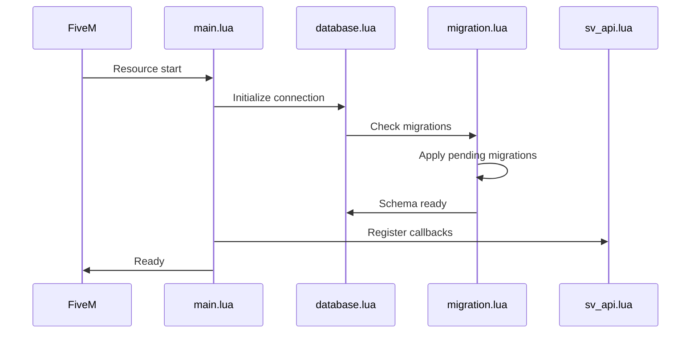

# Server Overview

The server-side of Dusa Modular Garages handles all secure operations including database access, vehicle ownership validation, and money transactions.

## Module Architecture

```
server/
├── proxy_config.lua          # Config proxy (escrow compatibility)
├── main.lua                  # Entry point and initialization
├── commands.lua              # Admin/debug commands
├── core/
│   ├── database.lua          # Database utilities and queries
│   ├── database_checker.lua  # Schema validation
│   ├── garage.lua            # Core garage logic
│   ├── spawn_zones.lua       # Spawn point management
│   ├── validation.lua        # Input validation
│   ├── valet.lua             # Valet service logic
│   └── modules/
│       ├── config_manager.lua     # Config hot-reload
│       ├── grade_validator.lua    # Job grade validation
│       ├── job_vehicles.lua       # Job vehicle management
│       ├── vehicle_ownership.lua  # Ownership checks
│       └── vehicle_photo_registry.lua # Photo cache
├── api/
│   ├── sv_api.lua            # Main API (40+ callbacks)
│   ├── sv_repair.lua         # Repair/fuel callbacks
│   └── test_commands.lua     # Test commands
├── database/
│   └── migration.lua         # Migration system
└── migration/
    ├── manager.lua           # Migration manager
    └── adapters/             # 14 migration adapters
```

## Initialization Flow



## Core Modules

### database.lua

Database utilities and common queries.

```lua
-- Key functions
GarageDatabase.GetGarage(garageId)
GarageDatabase.GetPlayerVehicles(identifier, garageId)
GarageDatabase.UpdateVehicleGarage(plate, garageId)
GarageDatabase.CreateGarage(data)
GarageDatabase.DeleteGarage(garageId)
```

### validation.lua

Input validation and security checks.

```lua
-- Key functions
GarageValidation.ValidatePlate(plate)
GarageValidation.ValidateGarageId(garageId)
GarageValidation.ValidateOwnership(source, plate)
GarageValidation.ValidateGarageAccess(source, garageId)
GarageValidation.ValidateJobAccess(source, garageType)
```

### vehicle_ownership.lua

Vehicle ownership verification.

```lua
-- Key functions
VehicleOwnership.IsOwner(source, plate)
VehicleOwnership.HasAccess(source, plate)  -- Includes shared access
VehicleOwnership.GetOwnerIdentifier(plate)
VehicleOwnership.IsVehicleSpawned(plate)
```

### spawn_zones.lua

Manage garage spawn points.

```lua
-- Key functions
SpawnZones.GetAvailableSpawnPoint(garageId)
SpawnZones.ReserveSpawnPoint(garageId, index)
SpawnZones.ReleaseSpawnPoint(garageId, index)
SpawnZones.GetAllSpawnPoints(garageId)
```

## API Structure (sv_api.lua)

The main API file contains 40+ callbacks organized by feature:

| Line Range | Feature Group |
|------------|---------------|
| 1-200 | Utilities & helpers |
| 1063-1200 | Store/spawn vehicle |
| 1217-1600 | Garage data queries |
| 1610-1800 | Garage management (CRUD) |
| 1827-1960 | Player data & permissions |
| 1962-2350 | Garage listing queries |
| 2354-2800 | Job garages |
| 2820-2875 | Vehicle transfer |
| 2877-2950 | Vehicle metadata |
| 2952-3400 | Impound system |
| 3586-3700 | Vehicle owner lookup |
| 3665-3780 | Preset loading |
| 3781-4100 | Showroom operations |
| 4176+ | Pagination |

## Security Measures

### Rate Limiting

```lua
-- Implemented in sv_api.lua
local rateLimits = {}
local function checkRateLimit(source)
    local id = GetPlayerIdentifier(source)
    local now = GetGameTimer()
    
    if rateLimits[id] and 
       rateLimits[id].count >= Config.Server.Security.RateLimiting.MaxRequests and
       now - rateLimits[id].time < Config.Server.Security.RateLimiting.Interval then
        return false
    end
    
    -- Update counter
    return true
end
```

### Ownership Validation

Every vehicle operation validates ownership:

```lua
lib.callback.register('dusa-garage:server:spawnVehicle', function(source, plate, garageId)
    -- 1. Validate inputs
    if not GarageValidation.ValidatePlate(plate) then return error end
    
    -- 2. Check ownership
    if not VehicleOwnership.IsOwner(source, plate) and
       not VehicleOwnership.HasAccess(source, plate) then
        return permissionDenied
    end
    
    -- 3. Check impound status
    if IsVehicleImpounded(plate) then return error end
    
    -- 4. Check mechanic lock
    if IsVehicleLockedByMechanic(plate) then return error end
    
    -- Proceed with spawn...
end)
```

### Server-Side Money

All money operations are server-side:

```lua
-- CORRECT: Server-side money deduction
local player = Framework.GetPlayer(source)
local hasMoney = player.GetMoney(accountType) >= amount
if hasMoney then
    player.RemoveMoney(accountType, amount)
end

-- NEVER trust client-side money checks
```

## Event Triggers

Server triggers these client events:

```lua
-- Garage data
TriggerClientEvent('dusa-garage:client:openGarage', source, garage, vehicles, config)
TriggerClientEvent('dusa-garage:client:updateGarageData', source, vehicles)
TriggerClientEvent('dusa-garage:client:refreshGarageZones', -1)

-- Vehicle operations
TriggerClientEvent('dusa-garage:client:vehicleStored', source, plate)
TriggerClientEvent('dusa-garage:client:vehicleSpawned', source, plate, netId)

-- Notifications
TriggerClientEvent('dusa-garage:client:notify', source, message, type)
TriggerClientEvent('dusa-garage:client:permissionDenied', source, reason)
```

## Database Queries

Common query patterns:

```lua
-- Async query
MySQL.query('SELECT * FROM dusa_garages WHERE type = ?', {'public'}, function(result)
    -- Handle result
end)

-- Sync query (await)
local result = MySQL.query.await('SELECT * FROM dusa_garages WHERE id = ?', {garageId})

-- Insert with ID return
local insertId = MySQL.insert.await('INSERT INTO dusa_garages (...) VALUES (...)', {...})

-- Update
MySQL.update.await('UPDATE dusa_garages SET name = ? WHERE id = ?', {newName, garageId})
```
